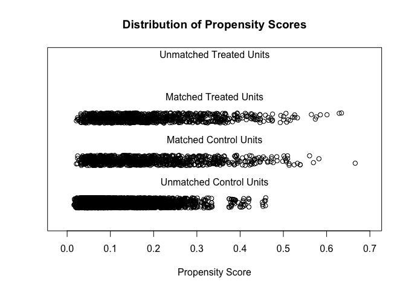
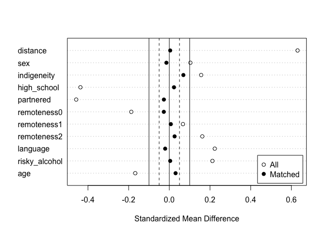

PSM
================
2024-02-18

## Load Data

- sex (0: Female; 1: Male)
- indigenous - Ingigenous status (0: Non-indigenous; 1: indigenous)
- high_school - Education level (0: not finished high school; 1:
  finished high school)
- partnered - Marital status (0: not partnered; 1: partnered)
- remoteness - region of residence (0: major cities; 1: inner regional;
  2: outer regional)
- language - Language background (0: non-English speaking; 1: English
  speaking)
- smoker - Smoking status (0: non-smoker; 1: smoker)
- risky_alcohol - Risky alcohol use (0: not risky; 1: risky)
- psyc_distress - Psychological distress. Measure ranges from 10 to 50.
- age - Age of the participants

## PSM

``` r
#Since remoteness is a categorical variable with more than two categories. It is necessary to convert 
#it into a factor variable.
#For other categorical variable with only 2 levels, this is optional if the variable is coded as 0 and 1.
df$remoteness <- factor(df$remoteness, exclude = c("", NA))

#Using the mathcit function from MatchIt to match each smoker with a non-smoker (1 to 1 matching) based on
#sex, indigeneity status, high school completion, marital status (partnered or not),
#region of residence (major cities, inner regional, outer regional), language background (English speaking Yes/No) 
#and risky alcohol drinking (Yes/No)
match_obj <- matchit(smoker ~ sex + indigeneity + high_school + partnered + remoteness + language + risky_alcohol + age,
  data = df, method = "nearest", distance ="glm",
  ratio = 1,
  replace = FALSE)
summary(match_obj)
```

    ## 
    ## Call:
    ## matchit(formula = smoker ~ sex + indigeneity + high_school + 
    ##     partnered + remoteness + language + risky_alcohol + age, 
    ##     data = df, method = "nearest", distance = "glm", replace = FALSE, 
    ##     ratio = 1)
    ## 
    ## Summary of Balance for All Data:
    ##               Means Treated Means Control Std. Mean Diff. Var. Ratio eCDF Mean
    ## distance             0.1852        0.1130          0.6304     2.0778    0.2033
    ## sex                  0.4938        0.4421          0.1035          .    0.0518
    ## indigeneity          0.0524        0.0175          0.1565          .    0.0349
    ## high_school          0.4220        0.6378         -0.4370          .    0.2158
    ## partnered            0.4630        0.6913         -0.4578          .    0.2283
    ## remoteness0          0.5852        0.6773         -0.1870          .    0.0921
    ## remoteness1          0.2177        0.1900          0.0670          .    0.0277
    ## remoteness2          0.1971        0.1327          0.1621          .    0.0645
    ## language             0.9579        0.9130          0.2234          .    0.0449
    ## risky_alcohol        0.6427        0.5411          0.2120          .    0.1016
    ## age                 51.6057       53.7824         -0.1676     0.8214    0.0441
    ##               eCDF Max
    ## distance        0.3185
    ## sex             0.0518
    ## indigeneity     0.0349
    ## high_school     0.2158
    ## partnered       0.2283
    ## remoteness0     0.0921
    ## remoteness1     0.0277
    ## remoteness2     0.0645
    ## language        0.0449
    ## risky_alcohol   0.1016
    ## age             0.1020
    ## 
    ## Summary of Balance for Matched Data:
    ##               Means Treated Means Control Std. Mean Diff. Var. Ratio eCDF Mean
    ## distance             0.1852        0.1847          0.0042     1.0209    0.0002
    ## sex                  0.4938        0.5010         -0.0144          .    0.0072
    ## indigeneity          0.0524        0.0370          0.0691          .    0.0154
    ## high_school          0.4220        0.4107          0.0229          .    0.0113
    ## partnered            0.4630        0.4764         -0.0268          .    0.0133
    ## remoteness0          0.5852        0.5986         -0.0271          .    0.0133
    ## remoteness1          0.2177        0.2146          0.0075          .    0.0031
    ## remoteness2          0.1971        0.1869          0.0258          .    0.0103
    ## language             0.9579        0.9620         -0.0205          .    0.0041
    ## risky_alcohol        0.6427        0.6407          0.0043          .    0.0021
    ## age                 51.6057       51.2064          0.0307     0.9171    0.0150
    ##               eCDF Max Std. Pair Dist.
    ## distance        0.0113          0.0052
    ## sex             0.0072          0.2854
    ## indigeneity     0.0154          0.2627
    ## high_school     0.0113          0.1725
    ## partnered       0.0133          0.1874
    ## remoteness0     0.0133          0.3230
    ## remoteness1     0.0031          0.2463
    ## remoteness2     0.0103          0.3407
    ## language        0.0041          0.1329
    ## risky_alcohol   0.0021          0.2957
    ## age             0.0390          0.3717
    ## 
    ## Sample Sizes:
    ##           Control Treated
    ## All          7026     974
    ## Matched       974     974
    ## Unmatched    6052       0
    ## Discarded       0       0

``` r
#plotting the balance between smokers and non-smokers
plot(match_obj, type = "jitter", interactive = FALSE)
```

<!-- -->

``` r
plot(summary(match_obj), abs = FALSE)
```

<!-- -->

## Output the result

``` r
#Extract the matched data and save the data into the variable matched_data
matched_data <- match.data(match_obj)

#Run regression model with psychological distress as the outcome, and smoker as the only predictor
#We need to specify the weights - Matched participants have a weight of 1, unmatched participants 
res <- lm(psyc_distress ~ smoker, data = matched_data, weights = weights)
summary(res)
```

    ## 
    ## Call:
    ## lm(formula = psyc_distress ~ smoker, data = matched_data, weights = weights)
    ## 
    ## Residuals:
    ##    Min     1Q Median     3Q    Max 
    ## -7.313 -5.313 -2.313  2.687 34.489 
    ## 
    ## Coefficients:
    ##             Estimate Std. Error t value Pr(>|t|)    
    ## (Intercept)  15.5113     0.2199  70.534  < 2e-16 ***
    ## smoker        1.8018     0.3110   5.794 8.01e-09 ***
    ## ---
    ## Signif. codes:  0 '***' 0.001 '**' 0.01 '*' 0.05 '.' 0.1 ' ' 1
    ## 
    ## Residual standard error: 6.863 on 1946 degrees of freedom
    ## Multiple R-squared:  0.01696,    Adjusted R-squared:  0.01645 
    ## F-statistic: 33.57 on 1 and 1946 DF,  p-value: 8.014e-09

``` r
#Test the coefficient using cluster robust standard error
coeftest(res, vcov. = vcovCL, cluster = ~subclass)
```

    ## 
    ## t test of coefficients:
    ## 
    ##             Estimate Std. Error t value  Pr(>|t|)    
    ## (Intercept) 15.51129    0.19383 80.0270 < 2.2e-16 ***
    ## smoker       1.80185    0.29709  6.0649 1.582e-09 ***
    ## ---
    ## Signif. codes:  0 '***' 0.001 '**' 0.01 '*' 0.05 '.' 0.1 ' ' 1

``` r
#Calculate the confidence intervals based on cluster robust standard error
coefci(res, vcov. = vcovCL, cluster = ~subclass, level = 0.95)
```

    ##                 2.5 %   97.5 %
    ## (Intercept) 15.131166 15.89142
    ## smoker       1.219196  2.38450
